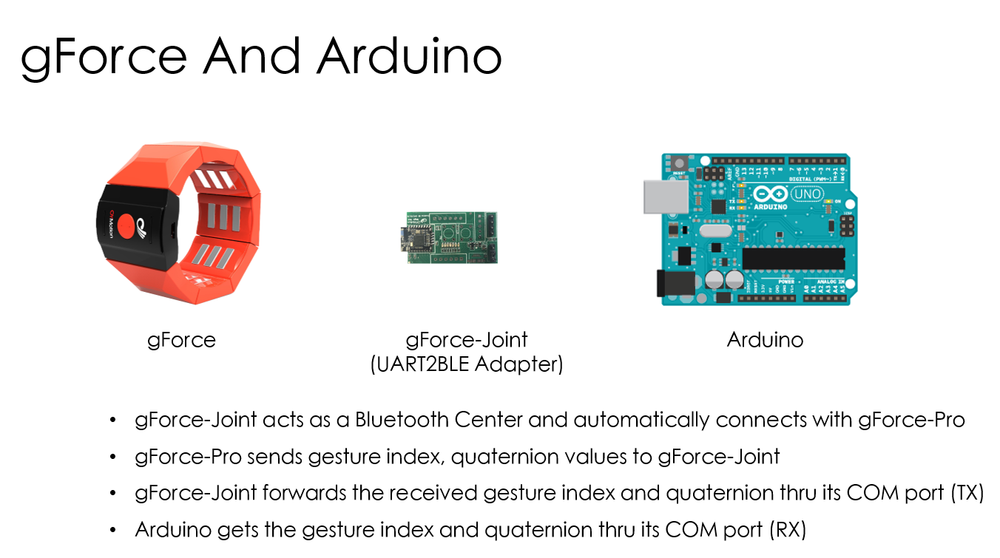
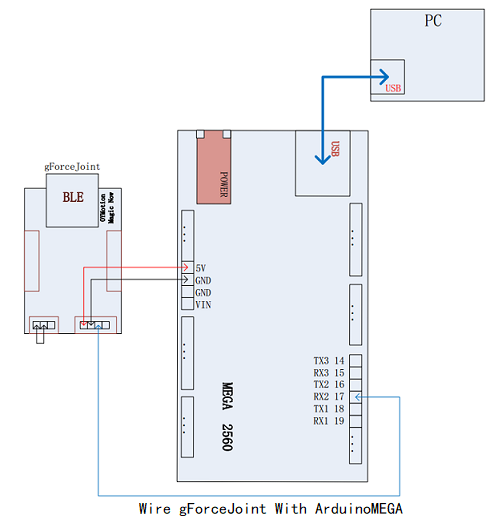
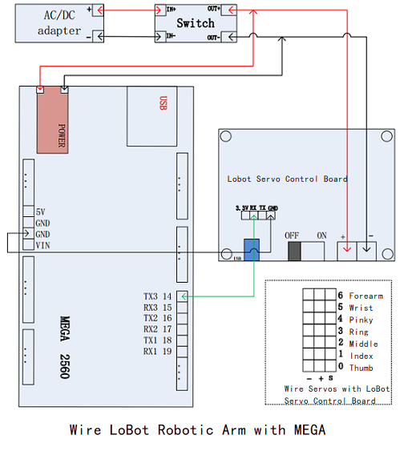
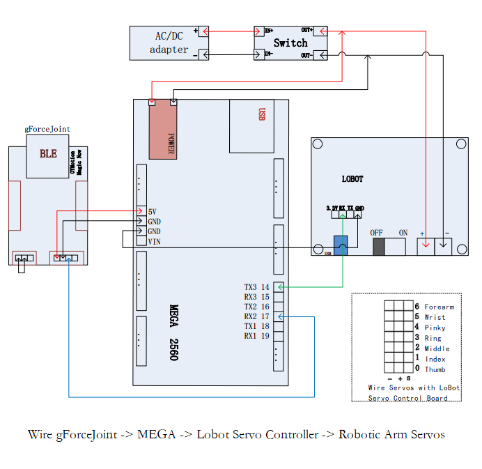

# Brief

This document tries to guiding how one can use gForce gesture armband to control a LoBot servo controller powered robotic arm with Arduino.
Before continuing, please make sure you have sufficient experience with [Arduino](https://www.arduino.cc/), and [ArduinoIDE](https://www.arduino.cc/en/Main/Software) was installed on your PC.

* [What is Arduino](https://www.arduino.cc/en/Guide/Introduction)
* [How to install ArduinoIDE](https://www.arduino.cc/en/Main/Software)
* [Learn Arduino](https://www.arduino.cc/en/Reference/HomePage)

## How to use gForce controlling a LoBot servo controller powered Robotic Arm?
This chapter guides the steps to control LoBot robotic arm with gForce armband. The following names are being used: gForceJoint, gForce, gForceSDKArduino, ArduinoMEGA
* [What is gForce](https://oymotion.github.io/gForce100/gForce100UserGuide/)
* [What is gForceJoint](https://oymotion.github.io/gForceEmbeddedSuit/gForce100EmbeddedSuiteUserGuide/)
* [What is gForceSDKArduino](https://github.com/oymotion/gForceSDKArduino)
* [What is ArduinoMEGA](https://www.arduino.cc/en/Main/arduinoBoardMega)

Remember, here users can replace the robotic arm with any other things that can be controlled. (users to change the Arduino code).

### Step 1: Import gForceSDKArduino  

* [How to import gForceSDKArduino](https://github.com/oymotion/gForceSDKArduino)

### Step 2: Test communication between gForceJoint and ArduinoMEGA:

1. Wire gForceJoint with ArduinoMEGA:  in this demo case, gForceJoint is connected to MEGA’s Serial Port #2 (gForceJoint (TX) => MEGA (RX2))
2. Open [gForceJointTest](https://github.com/zhoukaisspu/gForceExample/blob/master/LobotControlBygForce/project/gForceJointTest/gForceJointTest.ino) in ArduinoIDE. Compile and upload to ArduinoMEGA.
3. Open the Serial Port Monitor from ArduinoIDE.
4.	Set the serial port monitor with a baud rate of 15200bps.
5.	Pair and connect gForce armband to gForceJoint, perform the gestures that’s defined, check if the information printed out in the Serial Port Monitor is correct, and hence make sure the connect between gForceJoint and MEGA works. 

* [How to wear gForce armband?](https://oymotion.github.io/assets/downloads/gForce100_manual_v1.1-eng.pdf)  
If a gForce-100 is used, users should follow wearing instruction and gesture strictly.

* How to connect gForce with gForceJoint wirelessly?  
  * Turn on gForce armband, the green led should flash slowly
  * Make sure gForceJoint is powered on
  * Put gForce armband close to gForceJoint such as within 10 cm of distance.
  * gForce armband will automatically connect to gForceJoint. The green led should   flash much faster.
  * If not, make sure gForceJoint is not connected to other gForce armband. Only one armband is allowed. And, make sure, power is on.

* One should make sure gForceJoint works with ArduinoMEGA before continuing. Possible mistakes are: 
  * Wiring mistakes between gForceJoint and ArduinoMEAG
  * gForce doesn’t connect with gForceJoint because distance. When connecting, gForce armband and gForceJoint HAVE to be within a short distance as close as possible such as 10 cm.
  * User doesn’t follow armband wearing and gestures.

### Step 3: Lobot Robotic Arm Arduino Test

1.	Wire LoBot with ArduinoMEGA
2.	Connect ArduinoMEAG and PC with USB, open [LobotTest](https://github.com/oymotion/gForceExample/blob/master/LobotControlBygForce/project/LobotTest/LobotTest.ino) project in ArduinoIDE, compile and update to ArduinoMEAG
3.	Check if Lobot robotic arm performs gestures.
4.	Change the servo control settings to play around.
5.	If Lobot doesn’t perform the gestures properly, make sure it’s solved before continuing. Possible mistakes: 
>* Wiring mistakes between Lobot servo controller board and ArduinoMEGA (Serial port)  
>* Low Battery  
>* Wiring mistakes between servos in the robotic arm and LoBot

### Step 4: Debug gForce armband with Lobot powered Robotic Arm

1.	Wire gForceJoint, ArduinoMEGA, Lobot Servo Controller board and Robotic Arm together as shown in the upper figure.
2.	Connect ArduinoMEGA to PC with USB, open [LobotControlBygForce](https://github.com/oymotion/gForceExample/blob/master/LobotControlBygForce/project/LobotControlBygForce/LobotControlBygForce.ino)  project, compile and upload to ArduinoMEGA.
3.	Pair and connect gForce armband with gForceJoint, put gForce armband on forearm as instructed earlier. Try and see if the robotic arm and hand mimic your gesture. Have fun!
